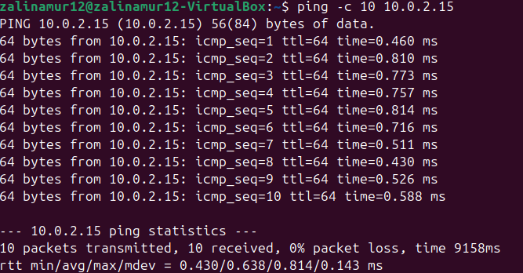
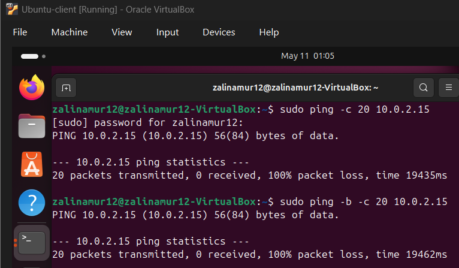
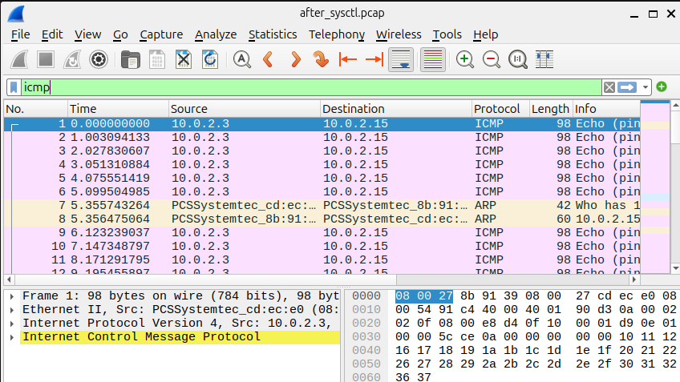

# Linux sysctl Network Hardening Lab

## Overview

This project demonstrates Linux network hardening using sysctl kernel tuning to modify ICMP behavior and improve network security.

The lab involved configuring Ubuntu virtual machines, capturing traffic with tshark, and analyzing ICMP behavior using Wireshark before and after hardening.

---

## Technologies Used

- Ubuntu 24.04
- sysctl
- tshark
- Wireshark
- ICMP
- Oracle VirtualBox

---

## Key Features

- Linux kernel network hardening
- ICMP response filtering
- Broadcast ping mitigation
- tshark packet capture
- Wireshark traffic analysis
- Before vs after traffic comparison

---

## Screenshots

### sysctl Configuration


### Ping Before Hardening


### Ping After Hardening


### Wireshark ICMP Analysis

---

## Report

The complete lab report is included in:

```text
Sysctl_Lab_ZM.docx
